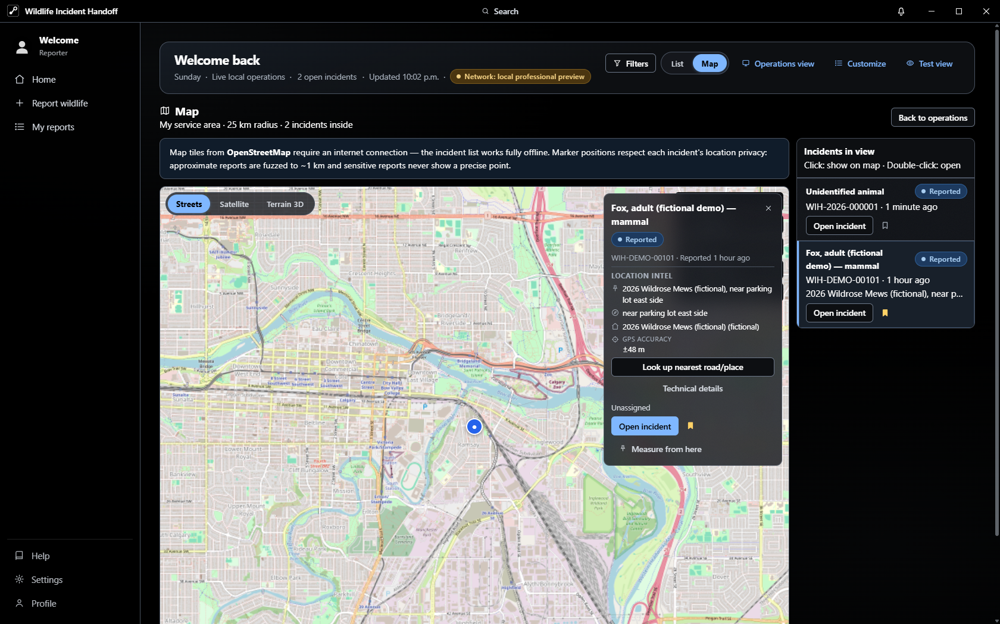
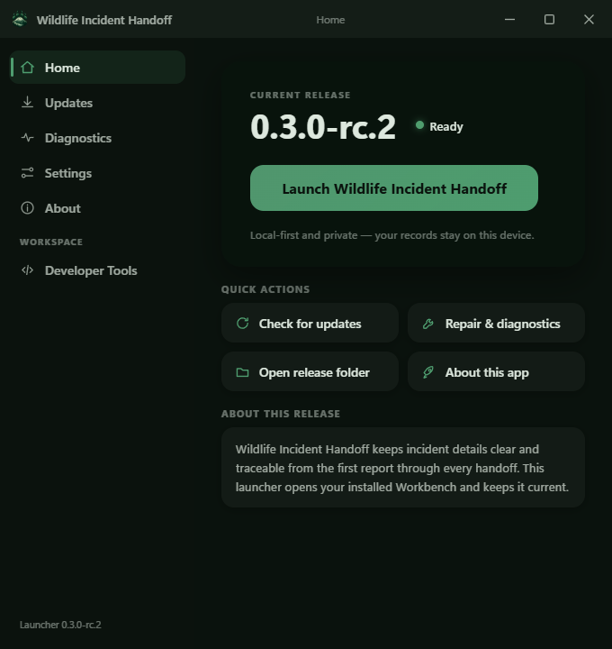
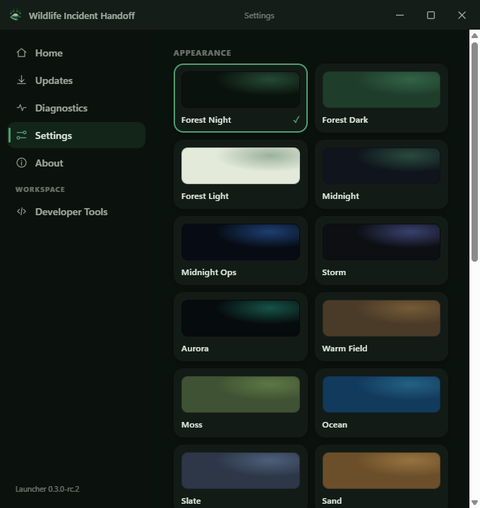

<div align="center">


# Wildlife Incident Handoff

**Clear information. Safer handoffs.**

An open-source, local-first desktop application for recording wildlife incidents and preserving context as information moves between reporters, responders, transporters, rehabilitation organizations and other wildlife professionals.

> Record what was observed. Keep uncertainty visible. Do not invent what is not known.

**Current release: 0.3.0-rc.2 (release candidate — Tester channel).** See [Releases](https://github.com/amgedi/Wildlife-Incident-Handoff/releases) for the installer, portable build and launcher. Use fictional/test data first; see [KNOWN_LIMITATIONS.md](docs/KNOWN_LIMITATIONS.md).

[](CHANGELOG.md)
[](LICENSE)
[](#development)

</div>

---

When someone finds injured wildlife, the important details end up scattered across phone calls, text messages, handwritten notes, photos, and memory. By the time the animal reaches a rehabilitator or vet, half the story is missing.

**Wildlife Incident Handoff** turns that scattered story into a clear, chronological, traceable incident record that can be passed from person to person without losing context:

> **Observe · Record · Hand off · Preserve context**

## HOW TO GET THE APP

- **Testers / normal users:** download the installer or portable EXE from [Releases](https://github.com/amgedi/Wildlife-Incident-Handoff/releases). No build tools needed.
- **Companion launcher:** the `Launch Wildlife Incident Handoff` launcher EXE is attached to each release (it is built locally, never committed to Git — binaries belong in Releases, not source history).
- **Source:** `src/` (frontend) · `src-tauri/` (desktop shell) · `launcher/` (the launcher's own Tauri project).
- **Documentation:** `docs/` · **Folder map:** `PROJECT_STRUCTURE.md`.

The launcher never installs anything from the internet and never overwrites
uncommitted work. RC releases are clearly labeled as pre-releases.

For the installed application: download
`Wildlife-Incident-Handoff-Setup-0.3.0-rc.2.exe` from
[Releases](https://github.com/amgedi/Wildlife-Incident-Handoff/releases), run
it once, then launch "Wildlife Incident Handoff" from the Start Menu. A
portable EXE sits beside it in the same download.

## What it is (and isn't)

This app records **what people actually observed** and supports **responsible handoff**. It is deliberately *not*:

- veterinary diagnostic software or medical advice
- a replacement for licensed wildlife professionals
- a capture guide or treatment planner

Where relevant, the app encourages safe behavior: observe from a distance, avoid unnecessary handling, keep people and pets away, and contact an appropriate licensed wildlife professional.

## Highlights

- **Unknown is valid** — species, age, sex, cause: never required, never faked. Observations like *"right wing hangs lower than left"* are preferred over diagnoses like *"broken wing"*.
- **Guided 10-step creation wizard** with autosaved drafts, draft recovery, and a review screen that distinguishes *Known / Unknown / Not provided*. Optional permission-gated current-location capture; denied permission never breaks the form.
- **Append-only timeline** — every observation, photo, status change, correction, and handoff becomes chronological history. Original entries are never overwritten; corrections record previous and new values with an optional reason.
- **Handoff & custody workflow** — record transfers of responsibility (from one responder to the next, method, condition, items transferred) and see the full custody chain at a glance. Reporter contact is by choice: anonymous by default.
- **Response operations dashboard** — service-area map, needs-attention queue, response flow, network pulse, live activity and deterministic analytics over local incidents. Nothing is transmitted (see [docs/NETWORK_ARCHITECTURE.md](docs/NETWORK_ARCHITECTURE.md)).
- **Map with location privacy** — 2D / satellite / terrain basemaps (MapLibre), incident side-list with single-click fly-to, cluster-aware camera, and measure tool. Approximate reports are fuzzed to ~1 km; sensitive reports never show a precise point.
- **Privacy-aware exports** — shareable summaries exclude precise coordinates, personal contacts, and private notes by default; internal exports include everything, by explicit choice.
- **Local-first storage** — everything lives on this device. No account, no cloud, no tracking. Versioned JSON backups with safe, staged restore.
- **Test View** — realistic fictional incidents (role × intensity × seed, reproducible) for training and demos, clearly labeled and safe to reset.
- **Accessible by design** — keyboard navigation, focus management, labeled forms, status never by color alone, reduced-motion support; works in short windows and narrow layouts.
- **Guide me, onboarding, product tour and tutorial** — deterministic coaching through a real report (no AI, no chatbot), plus clearly-labeled fictional demo cases.
- **Sixteen themes** — Forest Night (default), Aurora, Midnight Ops, Storm, Sand, Arctic, monochrome and high-contrast options; shared across app and launcher.
- **Native desktop app (Tauri 2)** — no terminal, no localhost; signed auto-update infrastructure and a companion launcher.

## Screenshots

| Operations dashboard (desktop) | Map — incident selected from the side list |
| --- | --- |
|  |  |
| **Companion launcher — Home** | **Launcher — theme gallery** |
|  |  |

*(All screenshots use fictional demo data.)*

## v0.1.0 Features

- Onboarding with experience modes (presentation presets only — never permissions)
- Guided incident creation: what happened, animal, location, observations, hazards, actions taken, current situation, contacts, photos, review
- Incident workspace: Overview, Timeline, Observations, Attachments, People & handoffs, Incident details, Export
- Status system (Reported  …  Released/Closed) with status-change history
- Handoff/transfer recording with custody history and consistency warnings
- Corrections with preserved history ("append, don't erase")
- Search & filters; Archive and Trash with restore + undo
- Export: printable handoff summary (browser print  PDF), text, HTML; JSON backup export/import with validation
- Fictional demo incidents, product tour, guided tutorial, contextual help
- Settings: appearance (4 themes, density, motion), accessibility, incident defaults, privacy, storage & backups, and more
- Installable PWA; core workflows work offline

## Privacy & data safety

- **All incident data is stored locally in your browser.** Nothing is uploaded, synced, or tracked — there is no server.
- Clearing browser data can delete local records; backups are recommended (Settings  Storage & backups).
- Exports never happen automatically. Shareable exports deliberately exclude sensitive information; precise wildlife locations can be marked *Sensitive* and are redacted by default.
- Personal contact details are marked private and excluded from shareable exports unless explicitly included.

## Installing & running (normal users)

**Web / PWA:** open the deployed site or serve the `dist/` folder with any static file server; install as a PWA from your browser menu. All data stays in your browser.

**Windows desktop:** download `Wildlife-Incident-Handoff-Setup-x.y.z.exe` from Releases, install, and launch **Wildlife Incident Handoff** from the Start Menu — a native window, no terminal, no local server. Uninstalling does not delete your incident data without an explicit, warned choice. (The desktop build is prepared via Tauri 2 — see the release assets.)

## Support development

If this project helps you, consider supporting it:
[GitHub Sponsors](https://github.com/sponsors/amgedi) ·
[Ko-fi](https://ko-fi.com/openfhs) ·
[Buymeacoffee](https://buymeacoffee.com/openfhs).
Links live here and in the app's About/Help — never inside wildlife workflows.

## Development (developers)

Requirements: **Node.js 20+** and npm. The desktop build additionally requires the Rust toolchain.

```bash
npm install        # install dependencies
npm run dev        # start the dev server (http://localhost:5173)
npm test           # run the test suite (Vitest)
npm run typecheck  # strict TypeScript check
npm run build      # typecheck + production build into dist/
npm run preview    # serve the production build locally
```

The production build in `dist/` is a fully offline-capable PWA. Serve it with any static file server (or `npm run preview`).

## Data format

Incidents are stored under a versioned schema (`schemaVersion: 1`) with a migration path established for future versions. Backups are JSON with `schemaVersion`, `applicationVersion`, and `exportedAt` metadata. Importing never silently overwrites existing incidents — ID conflicts are skipped and reported.

See [docs/HOW_THIS_APP_WORKS.md](docs/HOW_THIS_APP_WORKS.md) for a plain-English tour of the architecture, and [docs/GIT_AND_GITHUB.md](docs/GIT_AND_GITHUB.md) for the Git commands used in this repository.

## Limitations (v0.1)

- Single-device, single-browser: no synchronization (by design; optional sync is a future consideration).
- "Current browser" storage means clearing site data deletes records without a backup.
- Species identification is never verified automatically; no taxonomic lookup yet.
- Exports are human-readable documents, not an interchange standard.
- Not a substitute for professional wildlife care — see the safety boundary above.

## Roadmap

Restrained by design. Candidate areas for v0.2+:

- richer organization workflows and configurable intake forms
- optional secure synchronization / organization accounts
- improved map tools and optional taxonomic lookup
- rescue-directory integration, structured professional outcome fields
- richer attachments and interoperability

## Contributing

Beginner-friendly contributions are welcome! See [CONTRIBUTING.md](CONTRIBUTING.md) for setup, conventions, and the project's accessibility and privacy expectations. Security/privacy issues: [SECURITY.md](SECURITY.md).

## License

[AGPL-3.0-only](LICENSE) (GNU Affero General Public License v3.0 only). The license grants software rights only and implies nothing about veterinary authorization.

> Historical note: versions up to and including v0.1.0 were distributed under the MIT license; those historical copies remain available under the license that accompanied them. The development line from 0.2.0 onward is AGPL-3.0-only.

---

*Wildlife Incident Handoff — "I know what happened. I know who has the animal now. I can safely pass this record to the next person."*
