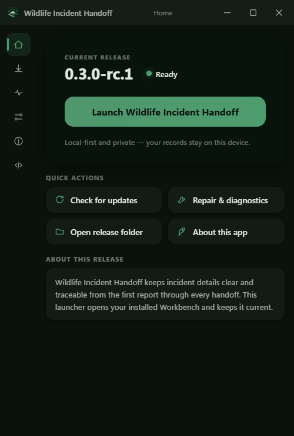
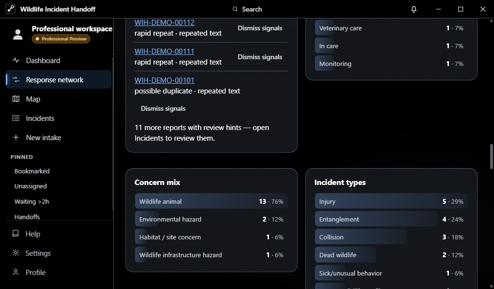

<div align="center">


<br/>

[](https://github.com/amgedi/Wildlife-Incident-Handoff/releases/tag/v0.3.0-rc.2)
[](https://github.com/amgedi/Wildlife-Incident-Handoff/actions/workflows/ci.yml)
[](LICENSE)
[](https://github.com/amgedi/Wildlife-Incident-Handoff/releases)

[](https://github.com/amgedi/Wildlife-Incident-Handoff/issues/new?template=bug_report.yml)
[](https://github.com/amgedi/Wildlife-Incident-Handoff/issues/new?template=feature_request.yml)
[](SECURITY.md)
[](docs/HOW_THIS_APP_WORKS.md)

</div>

# Wildlife Incident Handoff

**Clear information. Safer handoffs.**

Wildlife Incident Handoff is an open-source Windows desktop app for recording wildlife incidents and keeping context intact as information moves between finders, responders, transporters, rehabilitation organizations, veterinary teams, conservation staff, and other people involved in a handoff.

The core idea is simple:

> **Record what was observed. Keep uncertainty visible. Preserve the handoff.**

**Current public build:** `0.3.0-rc.2`, a release candidate for external testing. Use fictional data first while the RC series is being tested.

## Why it exists

Wildlife incidents get messy fast. Details end up scattered across calls, texts, photos, notes, memory, and different people. A small missing detail can become a big problem by the time an animal reaches the next person.

Wildlife Incident Handoff gives that information one place to live. It keeps observations, location context, timeline history, attachments, custody changes, corrections, and handoff details together without forcing users to pretend they know more than they do.

## What you can do

| | |
| --- | --- |
| **Record an incident** | Guided reporting with autosaved drafts, optional location capture, observations, hazards, actions, contacts, attachments, and a final review. |
| **Keep a real timeline** | Observations, corrections, status changes, media, and handoffs stay chronological. Corrections preserve what changed instead of silently replacing history. |
| **Coordinate a response** | Dashboard views surface active work, waiting incidents, handoffs, assignments, and operational context from local records. |
| **Work from a map** | 2D, satellite, and terrain views, clustering, side-list navigation, privacy-aware locations, measurement tools, and incident selection. |
| **Hand off clearly** | Track who had responsibility, when it changed, condition at transfer, and what moved with the animal. |
| **Export safely** | Shareable exports leave out precise coordinates, private contact information, and private notes by default. Internal exports are an explicit choice. |
| **Practice safely** | Test View fills the app with fictional incidents so the whole workflow can be explored without using real case data. |
| **Keep working offline** | Core incident workflows and local records remain available without an internet connection. |

## Screenshots

| Operations dashboard | Incident map |
| --- | --- |
|  |  |
| **Companion launcher** | **Responsive desktop layout** |
|  |  |

_All screenshots use fictional demo data._

## Download and run

Go to [Releases](https://github.com/amgedi/Wildlife-Incident-Handoff/releases) and open the newest release.

For most Windows users, choose the installer asset with `setup.exe` in its name. A portable EXE is also included if you do not want to install the app. The companion launcher is included as `wih-launcher.exe`.

RC releases are marked as pre-releases. Windows may show a SmartScreen warning because the RC binaries are not yet Authenticode signed. Tauri updater packages are cryptographically signed separately for in-app update verification.

Before testing, read [Known limitations](docs/KNOWN_LIMITATIONS.md) and [Tester guide](docs/TESTER_README.md).

## Privacy and network behavior

Incident records are local by default. There is no account requirement and no analytics or telemetry service in the app.

Some features can make network requests:

- map and terrain views can request map tiles or geocoding data from configured providers
- update checks contact GitHub when enabled
- optional LAN sync can exchange incident records directly with a trusted paired device on the local network

LAN sync is opt-in and uses an authenticated encrypted protocol. See [LAN sync security](docs/LAN_SYNC_SECURITY.md) for the threat model and remaining limitations.

Sensitive locations can be marked as sensitive, approximate locations are intentionally fuzzed, and shareable exports exclude sensitive fields by default.

## What this app is not

Wildlife Incident Handoff is not veterinary diagnostic software, medical advice, an emergency dispatch service, a treatment planner, or proof of professional credentials.

It is designed to help people record observations and move information more clearly. Where safety matters, the app encourages distance, minimal handling, and contacting an appropriate licensed wildlife professional.

## Accessibility

The app is built around keyboard access, visible focus, real form labels, non-color status cues, reduced motion support, and responsive layouts. Accessibility issues are treated as bugs.

If something blocks you, please [report it](https://github.com/amgedi/Wildlife-Incident-Handoff/issues/new?template=bug_report.yml).

## Documentation

| Document | What it covers |
| --- | --- |
| [How this app works](docs/HOW_THIS_APP_WORKS.md) | Plain-language product and architecture tour |
| [Feature list and roadmap](docs/FEATURE_LIST_AND_ROADMAP.md) | Current capabilities and deliberately parked ideas |
| [Known limitations](docs/KNOWN_LIMITATIONS.md) | RC limitations and unfinished validation |
| [LAN sync security](docs/LAN_SYNC_SECURITY.md) | Pairing, encryption, replay protection, trust, and known limits |
| [Security policy](SECURITY.md) | Private vulnerability reporting and supported versions |
| [Contributing](CONTRIBUTING.md) | Local setup, testing, privacy rules, and contribution expectations |

## Development

Requirements: Node.js 20+, npm, Rust, and the Tauri 2 toolchain for desktop builds.

```bash
npm install
npm run dev
npm test
npm run typecheck
npm run build
npm run launcher:build
```

Desktop packaging:

```bash
npm run tauri build
```

Pull requests are welcome. Contributions are accepted under `AGPL-3.0-only`.

## Release integrity

Release binaries are published through GitHub Releases. The release workflow runs the TypeScript checks, frontend test suite, Rust tests/builds, generates checksums, and signs Tauri updater artifacts.

The current RC2 release has one updater bootstrap limitation: the RC2 binary was shipped before the channel manifest endpoint was corrected. Users on RC2 may need one manual upgrade to the next RC before automatic channel updates work end to end. See [Known limitations](docs/KNOWN_LIMITATIONS.md).

## Support development

Support links are intentionally kept out of incident reporting and response workflows.

[](https://github.com/sponsors/amgedi)
[](https://ko-fi.com/openfhs)
[](https://buymeacoffee.com/openfhs)

## License

Wildlife Incident Handoff is licensed under [AGPL-3.0-only](LICENSE).

Versions up to and including `v0.1.0` were released under MIT. Those historical copies remain under the license that accompanied them.
