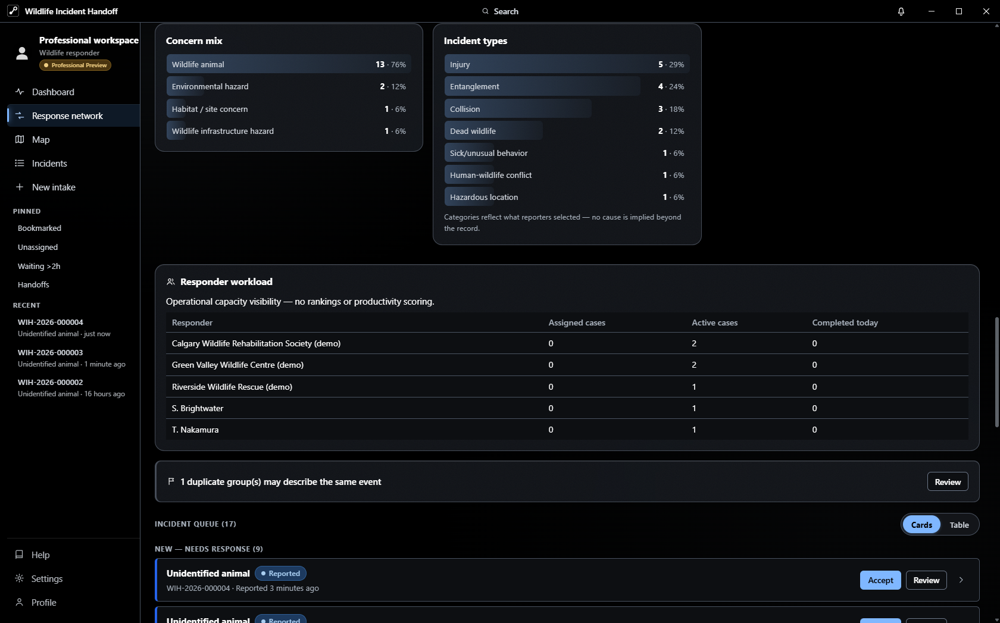
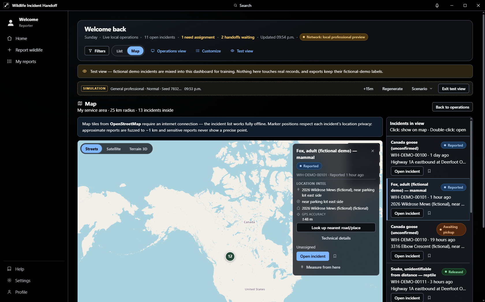
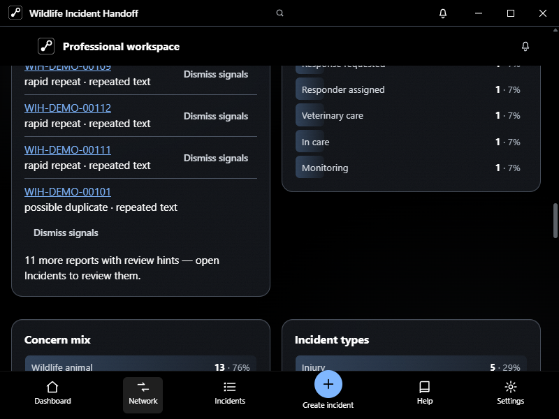

<div align="center">


<br/>



<br/>

[](https://github.com/amgedi/Wildlife-Incident-Handoff/releases/tag/v0.3.0-rc.2)
[](docs/wildlife-incident-handoff-demo.mp4)
[](docs/TESTER_README.md)
[](https://github.com/amgedi/Wildlife-Incident-Handoff/issues/new?template=bug_report.yml)

<br/>

[](https://github.com/amgedi/Wildlife-Incident-Handoff/releases)
[](https://github.com/amgedi/Wildlife-Incident-Handoff/actions/workflows/ci.yml)
[](https://github.com/amgedi/Wildlife-Incident-Handoff/actions/workflows/codeql.yml)
[](LICENSE)
[](https://github.com/amgedi/Wildlife-Incident-Handoff/releases)

[**How it works**](docs/HOW_THIS_APP_WORKS.md) · [**Tester feedback**](https://github.com/amgedi/Wildlife-Incident-Handoff/issues/new?template=tester_feedback.yml) · [**Feature request**](https://github.com/amgedi/Wildlife-Incident-Handoff/issues/new?template=feature_request.yml) · [**Accessibility**](https://github.com/amgedi/Wildlife-Incident-Handoff/issues/new?template=accessibility_issue.yml) · [**Security**](SECURITY.md)

</div>

# Wildlife Incident Handoff

**Clear information. Safer handoffs.**

Wildlife Incident Handoff is an open-source Windows desktop app for recording wildlife incidents and keeping context intact as information moves between finders, responders, transporters, rehabilitation organizations, veterinary teams, conservation staff, and other people involved in a handoff.

The core idea is simple:

> **Record what was observed. Keep uncertainty visible. Preserve the handoff.**

**Current public build:** `0.3.0-rc.2`, a release candidate for external testing. Use fictional data first while the RC series is being tested.

## Why it exists

Wildlife incidents get messy fast. Details end up scattered across calls, texts, photos, notes, memory, and different people. A small missing detail can become a big problem by the time an animal reaches the next person.

Wildlife Incident Handoff gives that information one place to live. It keeps observations, location context, timeline history, attachments, custody changes, corrections, and handoff details together without forcing users to pretend they know more than they do.

## What you can do

| | Capability | What it means in practice |
| --- | --- | --- |
| 📝 | **Guided incident capture** | Record what happened, where it happened, what was observed, who is involved, and what is still unknown. |
| 🕒 | **Full incident timeline** | Keep observations, corrections, status changes, media, and handoffs chronological so changes stay visible. |
| 🧭 | **Operational workspace** | Surface active work, waiting incidents, handoffs, assignments, and useful local context without turning response work into a speed leaderboard. |
| 🗺️ | **Map and location tools** | Use 2D, satellite, and terrain views, clustering, side-list navigation, measurements, privacy-aware locations, and direct incident inspection. |
| 🔄 | **Clear handoffs** | Track responsibility, condition at transfer, what changed, what is pending, and what moved with the animal. |
| 🔐 | **Share-safe exports** | Share handoff-ready information while excluding precise coordinates, private contacts, and private notes by default. |
| 🧪 | **Test View** | Explore the entire workflow with fictional incidents before entering anything real. |
| 💾 | **Local-first storage** | Keep core records on the device by default, with backup and recovery tools for continuity. |
| 🔗 | **Optional LAN sync** | Pair trusted devices on the same local network for authenticated encrypted exchange when that workflow is useful. |
| ♿ | **Accessible desktop workflow** | Use keyboard navigation, visible focus, reduced motion, responsive layouts, and status cues that do not rely on color alone. |

## From report to handoff

```text
Finder / reporter
      ↓
Record observations
      ↓
Responder / coordinator
      ↓
Transport / custody changes
      ↓
Rehab / veterinary / conservation follow-up
      ↓
Preserved timeline and outcome
```

At every step, **unknown stays unknown until somebody actually knows it**.

## Screenshots

<table>
<tr>
<td width="50%" valign="top"></td>
<td width="50%" valign="top"></td>
</tr>
<tr>
<td align="center"><b>Operational workspace</b><br/><sub>Active work, recent incidents, and response context.</sub></td>
<td align="center"><b>Map and incident inspection</b><br/><sub>Select an incident without losing map context.</sub></td>
</tr>
<tr>
<td width="50%" valign="top"></td>
<td width="50%" valign="top"></td>
</tr>
<tr>
<td align="center"><b>Responsive desktop layout</b><br/><sub>Usable when the app is not maximized.</sub></td>
<td align="center"><b>Companion launcher</b><br/><sub>Launch, update, repair, and diagnose the desktop build.</sub></td>
</tr>
</table>

_All screenshots shown in the README use fictional demo data._

## Download and run

[](https://github.com/amgedi/Wildlife-Incident-Handoff/releases/tag/v0.3.0-rc.2)

For most Windows users, choose the installer asset with `setup.exe` in its name. A portable EXE is included if you do not want to install the app. The companion launcher is published as `wih-launcher.exe`.

The release also includes SHA-256 checksums and a cryptographic signature for the Tauri update package.

RC releases are marked as pre-releases. Windows may show a SmartScreen warning because the current RC binaries are not yet Authenticode signed. Tauri updater packages are cryptographically signed separately for in-app update verification.

Before testing, read [Known limitations](docs/KNOWN_LIMITATIONS.md) and the [Tester guide](docs/TESTER_README.md).

## Privacy and network behavior

Incident records are local by default. There is no account requirement and no analytics or telemetry service in the app.

Some features can make network requests:

- map and terrain views can request map tiles or geocoding data from configured providers
- update checks contact GitHub when enabled
- optional LAN sync can exchange incident records directly with a trusted paired device on the local network

LAN sync is opt-in and uses an authenticated encrypted protocol. See [LAN sync security](docs/LAN_SYNC_SECURITY.md) for the threat model and remaining limitations.

Sensitive locations can be marked as sensitive, approximate locations are intentionally fuzzed, and shareable exports exclude sensitive fields by default.

## Designed for uncertain information

Wildlife incidents often begin with incomplete information. The software should not pressure someone into inventing an answer just to satisfy a form.

- **Unknown is a valid value.**
- Missing does not automatically mean no.
- Observations stay separate from diagnoses or conclusions.
- Corrections preserve history instead of silently rewriting it.
- Professional verification is only shown when it actually happened.
- Sensitive-location handling is explicit rather than invisible.

## What this app is not

Wildlife Incident Handoff is not veterinary diagnostic software, medical advice, an emergency dispatch service, a treatment planner, or proof of professional credentials.

It is designed to help people record observations and move information more clearly. Where safety matters, the app encourages distance, minimal handling, and contacting an appropriate licensed wildlife professional.

If an animal or person is in immediate danger, use the appropriate local emergency or wildlife service.

## Testing and feedback

Tester feedback is useful even if you are not a developer.

[](https://github.com/amgedi/Wildlife-Incident-Handoff/issues/new?template=bug_report.yml)
[](https://github.com/amgedi/Wildlife-Incident-Handoff/issues/new?template=tester_feedback.yml)
[](https://github.com/amgedi/Wildlife-Incident-Handoff/issues/new?template=feature_request.yml)
[](https://github.com/amgedi/Wildlife-Incident-Handoff/issues/new?template=accessibility_issue.yml)

Please use fictional or redacted information in public issues and screenshots. Do not post real sensitive wildlife coordinates, private contact information, or private case records.

## Documentation

| Document | What it covers |
| --- | --- |
| [How this app works](docs/HOW_THIS_APP_WORKS.md) | Plain-language product and workflow tour |
| [Tester guide](docs/TESTER_README.md) | First external testing steps |
| [Reporter testing guide](docs/TESTING_GUIDE_REPORTER.md) | Reporter-facing test flow |
| [Professional testing guide](docs/TESTING_GUIDE_PROFESSIONAL.md) | Professional-workspace test flow |
| [Feature list and roadmap](docs/FEATURE_LIST_AND_ROADMAP.md) | Current capabilities and future work |
| [Known limitations](docs/KNOWN_LIMITATIONS.md) | RC limitations and unfinished validation |
| [Privacy testing guide](docs/PRIVACY_TESTING_GUIDE.md) | Safe fictional-data testing |
| [Security policy](SECURITY.md) | Vulnerability reporting and supported versions |
| [LAN sync security](docs/LAN_SYNC_SECURITY.md) | Pairing, encryption, replay protection, trust, and known limits |

## Development

Requirements: Node.js 20+, npm, Rust, and the Tauri 2 toolchain for desktop builds.

```bash
npm install
npm run dev
npm test
npm run typecheck
npm run build
npm run launcher:build
```

Desktop packaging:

```bash
npm run tauri build
```

The desktop application uses **React + TypeScript + Vite + Tauri 2**. The companion launcher has its own React + TypeScript frontend and Tauri backend.

Pull requests are welcome. Contributions are accepted under `AGPL-3.0-only`. See [CONTRIBUTING.md](CONTRIBUTING.md) before opening a pull request.

## Release integrity

Release binaries are published through GitHub Releases. The release workflow runs TypeScript checks, frontend tests, Rust tests and builds, generates checksums, and signs Tauri updater artifacts.

The updater signing private key is **not** stored in this repository. GitHub Actions receives it through repository secrets during release builds.

The current RC2 release has one updater bootstrap limitation: the RC2 binary was shipped before the channel manifest endpoint was corrected. Users on RC2 may need one manual upgrade to the next RC before automatic channel updates work end to end. See [Known limitations](docs/KNOWN_LIMITATIONS.md).

## Support development

Support links are intentionally kept out of incident reporting and response workflows.

[](https://github.com/sponsors/amgedi)
[](https://ko-fi.com/openfhs)
[](https://buymeacoffee.com/openfhs)

## License

Wildlife Incident Handoff is licensed under [AGPL-3.0-only](LICENSE).

Versions up to and including `v0.1.0` were released under MIT. Those historical copies remain under the license that accompanied them.

<br/>

<div align="center">
  
</div>
